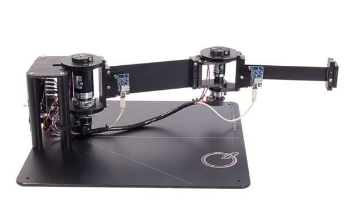

# Quanser 2 DOF Serial Flexible Link 

This is a repository with supporting material (texts, data, codes, ...) for the [Quanser 2DOF Serial Flexible Link](https://www.quanser.com/products/2-dof-serial-flexible-link/) apparatus. It is a simplified model of a robotic arm in which the links are designed as to exhibit visible harmonics during accelerations, while flexure in the joints is negligible.

