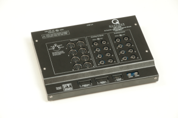
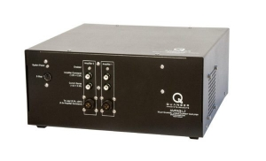
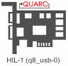

# Troubleshooting

Make sure that

- the power jack for the [Q8 USB DAQ board](https://www.quanser.com/products/q8-usb-data-acquisition-device/) is plugged in (the connector is on the back side on the left). There is no `Power ON/OFF` switch, therefore we just pull the jack out of the Q8 USB board to switch it off at the end of experiments. Occasionally somebody may also pulled out the AC-DC adapter from the wall. Unfortunately there is also no LED on the board that would allow easy checking;

 

- the Q8 USB DAQ board is connected to the PC using a USB cable. Ocasionally the cable is unplugged either on the side of the PC or on the side of the Q8 USB board;

- the [AMPAQ-L2 Amplifier](https://www.quanser.com/products/ampaq-l2-amplifier/) is switched on (the switch is on the back side);

 

- the power cable is connected to the experiment. Check also that the corresponding AC-DC adapter is connected to the mains (typically at the end of the experiment we just disconnect it);  

- the QUARC configuration block named [HIL Initialize](https://docs.quanser.com/quarc/documentation/hil_initialize_block.html) in the (upper right corner of the) diagram is correctly configured to the `Q8 USB` board. If you downloaded the code from the Quanser website, the block by default refers to `Q8`;

 

- the target is set to `quanser_win64.tlc`(and not `quanser_windows.tlc`, which would be the case if you use the code from the Quanser website).